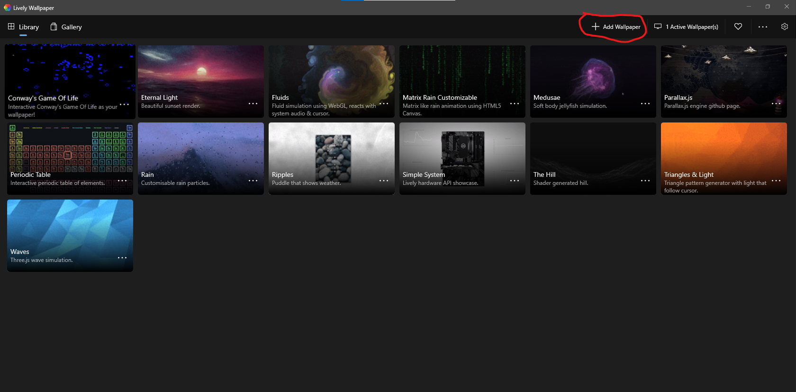
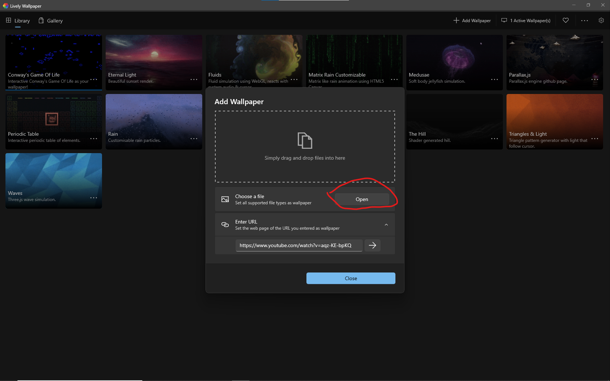
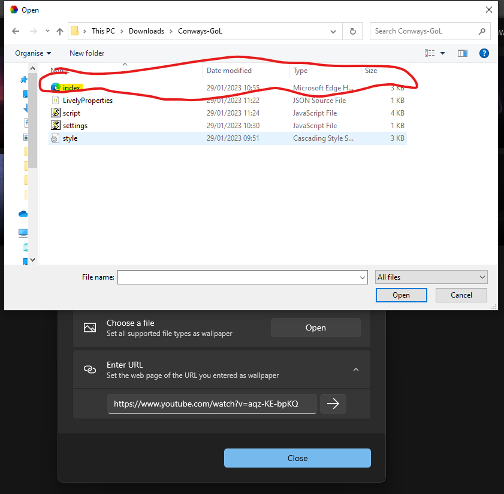
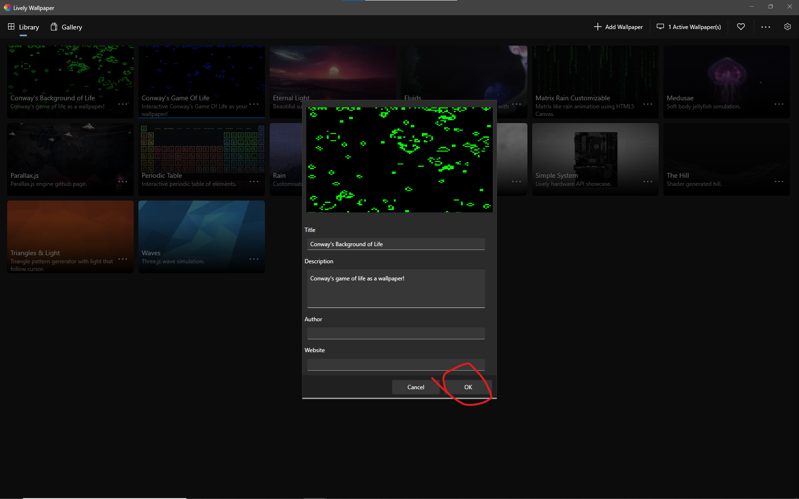

# Conway's Background of Life

**Installation:**
-
1. Download and install [Lively Wallpaper](https://www.rocksdanister.com/lively/)
2. Download this repl as a zip file
3. Find and unzip the file
4. Open Lively Wallpaper
5. Select 'Add Wallpaper'

6. Select 'Open'

7. Find where your unzipped folder is, and open 'index.html'

8. Set the title to one of your choice (I would use Conway's Background Of Life)
9. When done, click the 'OK' button

10. Voila! Your wallpaper is now Conway's Background of Life!

**Customisation and usage:**
-
You can access the customisation options by clicking on the three dots next to the wallpaper and selecting 'Customise'

There are several options for customisation:

- Live cell colour: The colour of the cells that are "Living" in the simulation
- Dead cell colour: The colour of the cells that are "Dead" in the simulation (You can think of this as a background colour)
- Simulation speed: How often the next frame gets rendered, higher is faster
- Clear board: Removes the board of all cells (Kills them all). Used when creating your own start patterns
- Paused: Pauses the simulation. Used when creating your own start patterns to prevent them from getting instantly started. As soon as this option is unchecked, the simulation starts

**YOU CAN RANDOMISE THE BOARD BY CLICKING ON THE CELL IN THE TOP LEFT CORNER**

*This is incase the board gets boring*

# Credits

- [ProfessorFish](https://discord.gg/u9gFdnu) - Creator of the simulation
- https://www.rocksdanister.com/ - Creator of Lively Wallpaper
- [John Horton Conway](https://en.wikipedia.org/wiki/John_Horton_Conway) - Creator of the Game of Life
